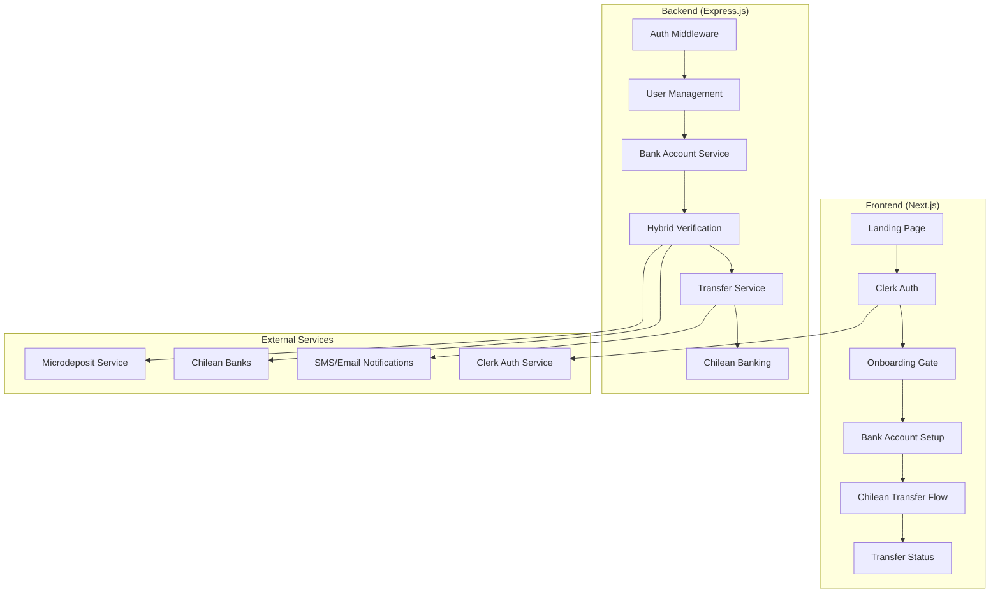
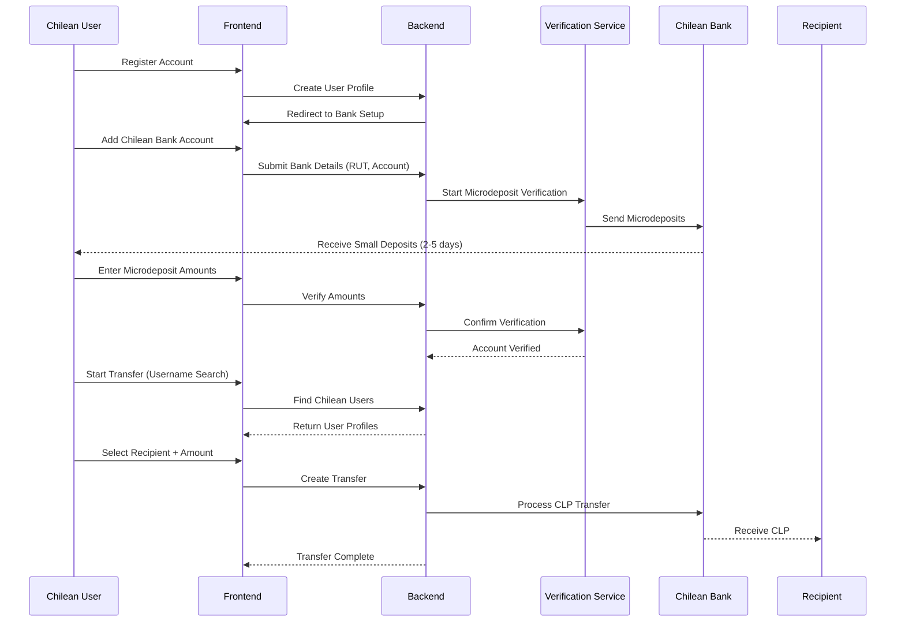

# Design Document

## Overview

The Chilean User Transfer MVP leverages the existing hybrid verification system, Clerk authentication, and Circle payment infrastructure to provide a complete user-to-user money transfer solution for the Chilean market. The design focuses on Chilean peso (CLP) transfers between verified users, utilizing the existing microdeposit verification system for Chilean bank accounts and building upon the established user authentication and transfer flow components.

## Architecture

### System Integration Overview


### Chilean-Specific Flow Architecture


## Components and Interfaces

### 1. Enhanced Onboarding Gate

#### ChileanOnboardingGate Component
```typescript
interface ChileanOnboardingGateProps {
  children: React.ReactNode;
  requireVerification: boolean;
  redirectPath?: string;
}

interface OnboardingStatus {
  hasAccount: boolean;
  hasBankAccount: boolean;
  hasVerifiedAccount: boolean;
  isChileanUser: boolean;
  completionPercentage: number;
}
```

The onboarding gate will be enhanced to specifically check for Chilean bank account verification and guide users through the complete setup process.

### 2. Chilean Bank Account Management

#### ChileanBankAccountForm Component
```typescript
interface ChileanBankAccount {
  id: string;
  accountName: string;
  bankName: string;
  bankCode: string;
  accountNumber: string;
  rut: string;
  accountHolderName: string;
  accountType: 'checking' | 'savings';
  isVerified: boolean;
  isPrimary: boolean;
  verificationStatus: 'pending' | 'microdeposits_sent' | 'awaiting_confirmation' | 'verified' | 'failed';
  microdepositsExpectedDate?: string;
  verificationAttempts: number;
}

interface ChileanBankFormData {
  accountName: string;
  bankId: string;
  accountNumber: string;
  rut: string;
  accountHolderName: string;
  accountType: 'checking' | 'savings';
}
```

### 3. Chilean User Discovery

#### ChileanUserSearch Component
```typescript
interface ChileanUserProfile {
  id: string;
  username: string;
  displayName: string;
  profilePicture?: string;
  isVerified: boolean;
  hasVerifiedChileanAccount: boolean;
  joinedDate: string;
  transferCount: number;
}

interface UserSearchResult {
  users: ChileanUserProfile[];
  totalCount: number;
  hasMore: boolean;
}

interface ChileanUserSearchProps {
  onUserSelected: (user: ChileanUserProfile) => void;
  excludeUserId: string;
  placeholder?: string;
}
```

### 4. Chilean Transfer Calculator

#### ChileanTransferCalculator Component
```typescript
interface ChileanTransferCalculation {
  sendAmount: number;
  receiveAmount: number;
  currency: 'CLP';
  fees: {
    processingFee: number;
    transferFee: number;
    total: number;
  };
  exchangeRate: 1; // CLP to CLP
  estimatedArrival: string;
  rateId: string;
  validUntil: string;
}

interface ChileanCalculatorProps {
  onCalculationComplete: (calculation: ChileanTransferCalculation) => void;
  initialAmount?: number;
  mode: 'send' | 'receive';
}
```

### 5. Chilean Payment Processing

#### ChileanPaymentForm Component
```typescript
interface ChileanPaymentMethod {
  id: string;
  type: 'chilean_bank_account';
  bankName: string;
  accountNumber: string;
  accountType: string;
  isVerified: boolean;
  isPrimary: boolean;
}

interface ChileanTransferRequest {
  recipientUserId: string;
  sendAmount: number;
  receiveAmount: number;
  paymentMethodId: string;
  calculationId: string;
  description?: string;
}
```

## Data Models

### Enhanced User Profile
```prisma
model User {
  id                    String   @id @default(cuid())
  clerkUserId           String   @unique
  username              String   @unique
  email                 String   @unique
  displayName           String?
  profilePicture        String?
  country               String?  @default("CL")
  preferredCurrency     String?  @default("CLP")
  isVerified            Boolean  @default(false)
  
  // Chilean-specific fields
  rut                   String?  @unique
  
  // Relationships
  bankAccounts          ChileanBankAccount[]
  sentTransfers         ChileanTransfer[] @relation("SentTransfers")
  receivedTransfers     ChileanTransfer[] @relation("ReceivedTransfers")
  
  createdAt             DateTime @default(now())
  updatedAt             DateTime @updatedAt
  
  @@index([username])
  @@index([country])
}
```

### Chilean Bank Account Model
```prisma
model ChileanBankAccount {
  id                    String   @id @default(cuid())
  userId                String
  user                  User     @relation(fields: [userId], references: [id])
  
  accountName           String
  bankName              String
  bankCode              String
  accountNumber         String
  rut                   String
  accountHolderName     String
  accountType           String   @default("checking")
  currency              String   @default("CLP")
  
  isVerified            Boolean  @default(false)
  isPrimary             Boolean  @default(false)
  isActive              Boolean  @default(true)
  
  // Verification tracking
  verificationId        String?  @unique
  verificationStatus    String   @default("pending")
  verificationMethod    String   @default("microdeposit")
  microdepositsAmount1  Int?
  microdepositsAmount2  Int?
  verificationAttempts  Int      @default(0)
  verificationExpiry    DateTime?
  
  createdAt             DateTime @default(now())
  updatedAt             DateTime @updatedAt
  
  @@index([userId])
  @@index([verificationStatus])
}
```

### Chilean Transfer Model
```prisma
model ChileanTransfer {
  id                    String   @id @default(cuid())
  
  // Participants
  senderId              String
  sender                User     @relation("SentTransfers", fields: [senderId], references: [id])
  recipientId           String
  recipient             User     @relation("ReceivedTransfers", fields: [recipientId], references: [id])
  
  // Transfer details
  sendAmount            Float
  receiveAmount         Float
  currency              String   @default("CLP")
  fees                  Float
  description           String?
  
  // Payment method
  paymentMethodId       String
  senderBankAccount     String
  recipientBankAccount  String
  
  // Status tracking
  status                String   @default("pending")
  statusHistory         Json     @default("[]")
  
  // Processing details
  calculationId         String?
  processingReference   String?  @unique
  bankTransactionId     String?
  
  // Timestamps
  createdAt             DateTime @default(now())
  updatedAt             DateTime @updatedAt
  completedAt           DateTime?
  
  @@index([senderId])
  @@index([recipientId])
  @@index([status])
  @@index([createdAt])
}
```

## Error Handling

### Chilean-Specific Error Types
```typescript
enum ChileanTransferError {
  INVALID_RUT = 'INVALID_RUT',
  BANK_ACCOUNT_NOT_VERIFIED = 'BANK_ACCOUNT_NOT_VERIFIED',
  RECIPIENT_NOT_FOUND = 'RECIPIENT_NOT_FOUND',
  RECIPIENT_NOT_VERIFIED = 'RECIPIENT_NOT_VERIFIED',
  INSUFFICIENT_FUNDS = 'INSUFFICIENT_FUNDS',
  TRANSFER_LIMIT_EXCEEDED = 'TRANSFER_LIMIT_EXCEEDED',
  MICRODEPOSIT_VERIFICATION_FAILED = 'MICRODEPOSIT_VERIFICATION_FAILED',
  CHILEAN_BANK_ERROR = 'CHILEAN_BANK_ERROR'
}

interface ChileanErrorResponse {
  error: ChileanTransferError;
  message: string;
  details?: {
    field?: string;
    code?: string;
    retryable: boolean;
    retryAfter?: number;
  };
  userMessage: string; // User-friendly message in Spanish
}
```

### Error Handling Strategy
- **RUT Validation Errors**: Real-time validation with clear formatting guidance
- **Bank Verification Errors**: Step-by-step guidance for microdeposit verification
- **Transfer Errors**: Clear messaging with retry options and support contact
- **Network Errors**: Offline capability with retry mechanisms

## Testing Strategy

### Unit Testing
- RUT validation functions
- Chilean bank account form validation
- Transfer calculation logic
- User search and filtering
- Microdeposit verification flow

### Integration Testing
- Complete onboarding flow for Chilean users
- Bank account addition and verification process
- User-to-user transfer creation and processing
- Status tracking and notifications
- Error handling and recovery scenarios

### End-to-End Testing
```typescript
describe('Chilean MVP End-to-End Flow', () => {
  test('Complete user onboarding and first transfer', async () => {
    // 1. User registration
    await registerChileanUser();
    
    // 2. Bank account setup
    await addChileanBankAccount();
    
    // 3. Microdeposit verification
    await simulateMicrodeposits();
    await verifyMicrodeposits();
    
    // 4. Find recipient user
    await searchForRecipient();
    
    // 5. Create and complete transfer
    await createTransfer();
    await confirmTransfer();
    
    // 6. Verify transfer completion
    await verifyTransferStatus();
  });
});
```

## Security Considerations

### Chilean Banking Security
- **RUT Encryption**: All RUT numbers encrypted at rest
- **Bank Account Masking**: Display only last 4 digits of account numbers
- **Transfer Limits**: Daily and monthly limits for new users
- **Fraud Detection**: Pattern analysis for unusual transfer behavior

### Compliance Requirements
- **Chilean Banking Regulations**: Compliance with local banking laws
- **AML/KYC**: Basic identity verification through RUT validation
- **Data Privacy**: GDPR-compliant data handling for Chilean users
- **Transaction Monitoring**: Automated flagging of suspicious activities

## Performance Considerations

### Chilean Market Optimization
- **Database Indexing**: Optimized queries for Chilean user searches
- **Caching Strategy**: User profiles and bank account data caching
- **Mobile Performance**: Optimized for Chilean mobile networks
- **Offline Capability**: Basic functionality during network issues

### Scalability Planning
- **User Growth**: Architecture supports 10,000+ Chilean users
- **Transfer Volume**: Handles 1,000+ daily transfers
- **Bank Integration**: Scalable microdeposit processing
- **Monitoring**: Real-time performance and error tracking

## Implementation Phases

### Phase 1: Core Chilean Infrastructure (Week 1-2)
- Enhanced onboarding gate with Chilean requirements
- Chilean bank account form with RUT validation
- Microdeposit verification integration
- Basic user profile management

### Phase 2: User Discovery and Transfer Flow (Week 3-4)
- Chilean user search functionality
- Transfer calculator for CLP
- Payment form integration
- Transfer status tracking

### Phase 3: Polish and Testing (Week 5-6)
- Mobile optimization
- Error handling improvements
- End-to-end testing
- Performance optimization

### Phase 4: Production Deployment (Week 7-8)
- Production environment setup
- Monitoring and logging
- User acceptance testing
- Gradual rollout to Chilean users

## Monitoring and Analytics

### Chilean Market Metrics
- User registration and onboarding completion rates
- Bank account verification success rates
- Transfer volume and success rates
- User engagement and retention
- Error rates and resolution times

### Business Intelligence
- Average transfer amounts and frequency
- Popular transfer corridors within Chile
- User acquisition and growth patterns
- Revenue and cost analysis
- Customer satisfaction metrics