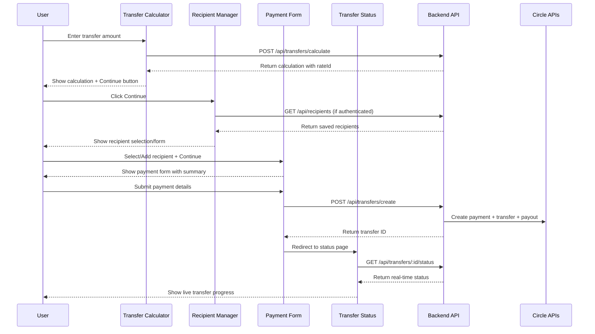
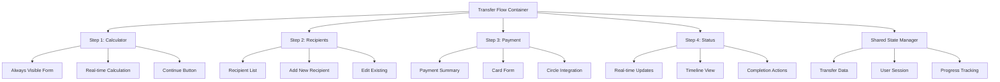

# Design Document

## Overview

The frontend user experience improvements focus on creating a seamless, intuitive multi-step transfer flow that leverages the existing Circle-powered backend infrastructure. The design transforms the current disconnected components into a cohesive user journey from transfer calculation through completion, with proper state management, authentication integration, and real-time status updates.

## Architecture

### High-Level User Flow


### Component Architecture

The design follows a multi-step wizard pattern with shared state management:



## Components and Interfaces

### 1. Transfer Flow Container

The main container component that manages the multi-step flow and shared state.

```typescript
interface TransferFlowState {
  currentStep: 'calculator' | 'recipient' | 'payment' | 'status';
  transferData: {
    sendAmount: number;
    receiveAmount: number;
    exchangeRate: number;
    fees: number;
    rateId: string;
    rateValidUntil: string;
  } | null;
  recipientData: RecipientInfo | null;
  transferId: string | null;
  isAuthenticated: boolean;
  user: User | null;
}

interface TransferFlowContainerProps {
  initialStep?: 'calculator';
  onComplete?: (transferId: string) => void;
}

export function TransferFlowContainer({ 
  initialStep = 'calculator', 
  onComplete 
}: TransferFlowContainerProps) {
  // State management and step navigation logic
}
```

### 2. Enhanced Transfer Calculator

Updated to always show the form, support multiple currencies, and provide calculation mode switching.

```typescript
interface SupportedCurrency {
  code: string;
  name: string;
  symbol: string;
  flag: string;
  countries: string[];
}

interface TransferCalculationData {
  sendAmount: number;
  receiveAmount: number;
  sendCurrency: string;
  receiveCurrency: string;
  exchangeRate: number;
  fees: number;
  rateId: string;
  rateValidUntil: string;
  breakdown: FeeBreakdown;
  estimatedArrival: string;
}

interface EnhancedTransferCalculatorProps {
  onContinue: (data: TransferCalculationData) => void;
  initialAmount?: number;
  initialSendCurrency?: string;
  initialReceiveCurrency?: string;
  showContinueButton?: boolean;
  isLoading?: boolean;
  supportedCurrencies?: SupportedCurrency[];
}

export function EnhancedTransferCalculator({
  onContinue,
  initialAmount = 100,
  initialSendCurrency = 'USD',
  initialReceiveCurrency = 'EUR',
  showContinueButton = true,
  isLoading = false,
  supportedCurrencies = DEFAULT_SUPPORTED_CURRENCIES
}: EnhancedTransferCalculatorProps) {
  // Always visible form with immediate calculation
  // Multi-currency support with dropdown selectors
  // Calculator mode switcher (You Send / Recipient Gets)
  // Real-time exchange rate updates
  // Prominent continue button when calculation is valid
  // Loading states and error handling
}
```

### 3. Recipient Manager Component

New component for selecting or adding recipients.

```typescript
interface RecipientInfo {
  id?: string;
  name: string;
  email: string;
  bankAccount: {
    iban: string;
    bic: string;
    bankName: string;
    accountHolderName: string;
    country: 'DE';
  };
  isDefault?: boolean;
  createdAt?: string;
}

interface RecipientManagerProps {
  onRecipientSelected: (recipient: RecipientInfo) => void;
  onBack: () => void;
  transferSummary: {
    sendAmount: number;
    receiveAmount: number;
    fees: number;
  };
}

export function RecipientManager({
  onRecipientSelected,
  onBack,
  transferSummary
}: RecipientManagerProps) {
  // List saved recipients (if authenticated)
  // Add new recipient form
  // Edit existing recipient
  // Validation and error handling
}
```

### 4. Enhanced Payment Form

Updated to integrate with the flow and show transfer summary.

```typescript
interface EnhancedPaymentFormProps {
  transferData: TransferCalculationData;
  recipientData: RecipientInfo;
  onSuccess: (transferId: string) => void;
  onBack: () => void;
  onError: (error: string) => void;
}

export function EnhancedPaymentForm({
  transferData,
  recipientData,
  onSuccess,
  onBack,
  onError
}: EnhancedPaymentFormProps) {
  // Transfer summary display
  // Card payment form
  // Circle payment processing
  // Loading states and error handling
}
```

### 5. Progress Indicator Component

Visual progress indicator for the multi-step flow.

```typescript
interface ProgressIndicatorProps {
  currentStep: 'calculator' | 'recipient' | 'payment' | 'status';
  completedSteps: string[];
  onStepClick?: (step: string) => void;
}

export function ProgressIndicator({
  currentStep,
  completedSteps,
  onStepClick
}: ProgressIndicatorProps) {
  // Visual step indicator
  // Click navigation (if allowed)
  // Mobile-optimized display
}
```

## Multi-Currency Support

### Supported Currency Configuration

```typescript
interface SupportedCurrency {
  code: string; // ISO 4217 currency code
  name: string; // Full currency name
  symbol: string; // Currency symbol
  flag: string; // Country flag emoji or URL
  countries: string[]; // Countries that use this currency
  minAmount: number; // Minimum transfer amount
  maxAmount: number; // Maximum transfer amount
  decimalPlaces: number; // Number of decimal places
}

const DEFAULT_SUPPORTED_CURRENCIES: SupportedCurrency[] = [
  {
    code: 'USD',
    name: 'US Dollar',
    symbol: '$',
    flag: '🇺🇸',
    countries: ['United States'],
    minAmount: 1,
    maxAmount: 50000,
    decimalPlaces: 2
  },
  {
    code: 'EUR',
    name: 'Euro',
    symbol: '€',
    flag: '🇪🇺',
    countries: ['Germany', 'France', 'Spain', 'Italy'],
    minAmount: 1,
    maxAmount: 45000,
    decimalPlaces: 2
  },
  {
    code: 'CLP',
    name: 'Chilean Peso',
    symbol: '$',
    flag: '🇨🇱',
    countries: ['Chile'],
    minAmount: 800,
    maxAmount: 40000000,
    decimalPlaces: 0
  },
  {
    code: 'MXN',
    name: 'Mexican Peso',
    symbol: '$',
    flag: '🇲🇽',
    countries: ['Mexico'],
    minAmount: 20,
    maxAmount: 1000000,
    decimalPlaces: 2
  },
  {
    code: 'GBP',
    name: 'British Pound',
    symbol: '£',
    flag: '🇬🇧',
    countries: ['United Kingdom'],
    minAmount: 1,
    maxAmount: 40000,
    decimalPlaces: 2
  }
];
```

### Calculator Mode Types

```typescript
type CalculatorMode = 'send' | 'receive';

interface CalculatorModeConfig {
  mode: CalculatorMode;
  label: string;
  description: string;
  inputLabel: string;
  outputLabel: string;
}

const CALCULATOR_MODES: Record<CalculatorMode, CalculatorModeConfig> = {
  send: {
    mode: 'send',
    label: 'You Send',
    description: 'Enter how much you want to send',
    inputLabel: 'You send',
    outputLabel: 'Recipient gets'
  },
  receive: {
    mode: 'receive',
    label: 'Recipient Gets',
    description: 'Enter how much recipient should receive',
    inputLabel: 'Recipient gets',
    outputLabel: 'You send'
  }
};
```

## Data Models

### Enhanced Transfer Flow State

```typescript
interface TransferFlowState {
  // Current step in the flow
  currentStep: 'calculator' | 'recipient' | 'payment' | 'status';
  
  // Transfer calculation data with multi-currency support
  transferData: {
    sendAmount: number;
    receiveAmount: number;
    sendCurrency: string; // ISO currency code
    receiveCurrency: string; // ISO currency code
    exchangeRate: number;
    fees: number;
    rateId: string;
    rateValidUntil: string;
    calculatorMode: CalculatorMode; // 'send' or 'receive'
    breakdown: {
      sendAmount: number;
      sendCurrency: string;
      fees: {
        cardProcessing: number;
        transfer: number;
        payout: number;
        total: number;
      };
      netAmount: number;
      exchangeRate: number;
      receiveAmount: number;
      receiveCurrency: string;
    };
    estimatedArrival: string;
  } | null;
  
  // Selected recipient information
  recipientData: RecipientInfo | null;
  
  // Created transfer ID
  transferId: string | null;
  
  // Authentication state
  isAuthenticated: boolean;
  user: User | null;
  
  // UI state
  isLoading: boolean;
  error: string | null;
  
  // Navigation state
  canGoBack: boolean;
  completedSteps: string[];
}
```

### Enhanced Recipient Model with Multi-Currency Support

```typescript
interface BankAccountInfo {
  // European bank account (IBAN/BIC)
  iban?: string;
  bic?: string;
  // US bank account (ACH)
  routingNumber?: string;
  accountNumber?: string;
  // Chilean bank account
  rut?: string;
  bankCode?: string;
  // Mexican bank account (CLABE)
  clabe?: string;
  // UK bank account
  sortCode?: string;
  accountNumber?: string;
  
  // Common fields
  bankName: string;
  accountHolderName: string;
  country: string; // ISO country code
  currency: string; // ISO currency code
  accountType?: 'checking' | 'savings';
}

interface RecipientInfo {
  id?: string; // Optional for new recipients
  name: string;
  email: string;
  bankAccount: BankAccountInfo;
  preferredCurrency: string; // Default currency for this recipient
  isDefault?: boolean;
  createdAt?: string;
  lastUsed?: string;
  userId?: string; // For authenticated users
}

interface SavedRecipient extends RecipientInfo {
  id: string;
  userId: string;
  createdAt: string;
  lastUsed: string;
  transferCount: number;
  supportedCurrencies: string[]; // Currencies this recipient can receive
}
```

## API Enhancements

### New Recipient Management Endpoints

```typescript
// GET /api/recipients - Get user's saved recipients
interface GetRecipientsResponse {
  recipients: SavedRecipient[];
  total: number;
}

// POST /api/recipients - Save new recipient
interface CreateRecipientRequest {
  name: string;
  email: string;
  bankAccount: BankAccountInfo;
  isDefault?: boolean;
}

// PUT /api/recipients/:id - Update recipient
interface UpdateRecipientRequest {
  name?: string;
  email?: string;
  bankAccount?: BankAccountInfo;
  isDefault?: boolean;
}

// DELETE /api/recipients/:id - Delete recipient
```

### Enhanced Transfer Creation

```typescript
// POST /api/transfers/create - Enhanced with recipient handling
interface EnhancedCreateTransferRequest {
  sendAmount: number;
  rateId: string;
  cardDetails: CardDetails;
  recipientInfo: RecipientInfo;
  saveRecipient?: boolean; // Save for future use
  setAsDefault?: boolean; // Set as default recipient
}

interface EnhancedCreateTransferResponse {
  transferId: string;
  status: TransferStatus;
  estimatedCompletion: string;
  recipientId?: string; // If recipient was saved
}
```

## State Management

### React Context for Transfer Flow

```typescript
interface TransferFlowContextValue {
  state: TransferFlowState;
  actions: {
    setTransferData: (data: TransferCalculationData) => void;
    setRecipientData: (data: RecipientInfo) => void;
    setTransferId: (id: string) => void;
    goToStep: (step: string) => void;
    goBack: () => void;
    reset: () => void;
    setLoading: (loading: boolean) => void;
    setError: (error: string | null) => void;
  };
}

export const TransferFlowContext = createContext<TransferFlowContextValue | null>(null);

export function TransferFlowProvider({ children }: { children: React.ReactNode }) {
  // State management logic
  // Persistence to localStorage for unauthenticated users
  // Integration with authentication state
}
```

### Local Storage Strategy

For unauthenticated users, preserve transfer state across page refreshes:

```typescript
interface PersistedTransferState {
  transferData: TransferCalculationData | null;
  recipientData: RecipientInfo | null;
  currentStep: string;
  timestamp: number;
  expiresAt: number; // Based on rate validity
}

class TransferStateManager {
  private static STORAGE_KEY = 'transfer_flow_state';
  private static EXPIRY_MINUTES = 10; // Match rate validity
  
  static saveState(state: TransferFlowState): void {
    // Save to localStorage with expiry
  }
  
  static loadState(): TransferFlowState | null {
    // Load from localStorage, check expiry
  }
  
  static clearState(): void {
    // Clear expired or completed state
  }
}
```

## User Experience Enhancements

### 1. Always-Visible Calculator

- Form is always visible with helpful placeholders
- Real-time calculation as user types
- Clear visual feedback for validation errors
- Prominent continue button when calculation is valid

### 2. Seamless Navigation

- Clear progress indicator showing current step
- Back navigation with state preservation
- Breadcrumb navigation for completed steps
- Mobile-optimized step transitions

### 3. Smart Recipient Management

- Quick selection from saved recipients
- Inline editing of recipient details
- Smart defaults based on usage history
- Validation with helpful error messages

### 4. Enhanced Payment Experience

- Clear transfer summary before payment
- Real-time payment processing feedback
- Automatic redirect to status page
- Error handling with retry options

### 5. Real-time Status Updates

- Live progress tracking with webhooks
- Timeline view of transfer events
- Push notifications for status changes
- Completion actions (share, repeat transfer)

## Mobile Optimization

### Responsive Design Patterns

```typescript
// Mobile-first responsive breakpoints
const breakpoints = {
  mobile: '0px',
  tablet: '768px',
  desktop: '1024px'
};

// Mobile-optimized step transitions
const mobileStepTransition = {
  transform: 'translateX(-100%)',
  transition: 'transform 0.3s ease-in-out'
};

// Touch-friendly form elements
const mobileFormStyles = {
  minHeight: '44px', // iOS touch target minimum
  fontSize: '16px', // Prevent zoom on iOS
  padding: '12px 16px'
};
```

### Mobile-Specific Features

- Swipe navigation between steps
- Native keyboard optimization
- Touch-friendly form controls
- Optimized loading states
- Offline state handling

## Error Handling Strategy

### Comprehensive Error Boundaries

```typescript
interface TransferFlowErrorBoundaryState {
  hasError: boolean;
  error: Error | null;
  errorInfo: ErrorInfo | null;
  step: string;
}

export class TransferFlowErrorBoundary extends Component<
  PropsWithChildren<{}>,
  TransferFlowErrorBoundaryState
> {
  // Error boundary with step-specific recovery
  // Preserve user data during errors
  // Provide helpful error messages
  // Support contact and retry options
}
```

### Error Recovery Patterns

- Automatic retry for network errors
- State preservation during errors
- Clear error messages with next steps
- Fallback UI for critical failures
- Support contact integration

## Performance Optimization

### Code Splitting Strategy

```typescript
// Lazy load steps to reduce initial bundle size
const RecipientManager = lazy(() => import('./RecipientManager'));
const PaymentForm = lazy(() => import('./PaymentForm'));
const TransferStatus = lazy(() => import('./TransferStatus'));

// Preload next step components
const preloadNextStep = (currentStep: string) => {
  switch (currentStep) {
    case 'calculator':
      import('./RecipientManager');
      break;
    case 'recipient':
      import('./PaymentForm');
      break;
    case 'payment':
      import('./TransferStatus');
      break;
  }
};
```

### Caching Strategy

- Cache exchange rates with TTL
- Cache recipient data for authenticated users
- Optimistic updates for better UX
- Background refresh for stale data

## Security Considerations

### Data Protection

- Sensitive data encryption in localStorage
- Automatic state cleanup on completion
- Secure transmission of payment data
- PCI compliance through Circle integration

### Authentication Integration

- Seamless sign-in prompts at appropriate steps
- State preservation across authentication
- Secure session management
- Automatic cleanup on sign-out

## Testing Strategy

### Component Testing

```typescript
// Test each step component in isolation
describe('EnhancedTransferCalculator', () => {
  it('should always show form even when empty', () => {
    // Test always-visible form requirement
  });
  
  it('should enable continue button when calculation is valid', () => {
    // Test navigation enablement
  });
  
  it('should preserve state during navigation', () => {
    // Test state management
  });
});
```

### Integration Testing

- Complete flow testing from start to finish
- Authentication integration testing
- Error scenario testing
- Mobile responsiveness testing
- Performance testing under load

### User Acceptance Testing

- Usability testing with real users
- Mobile device testing
- Accessibility compliance testing
- Cross-browser compatibility testing