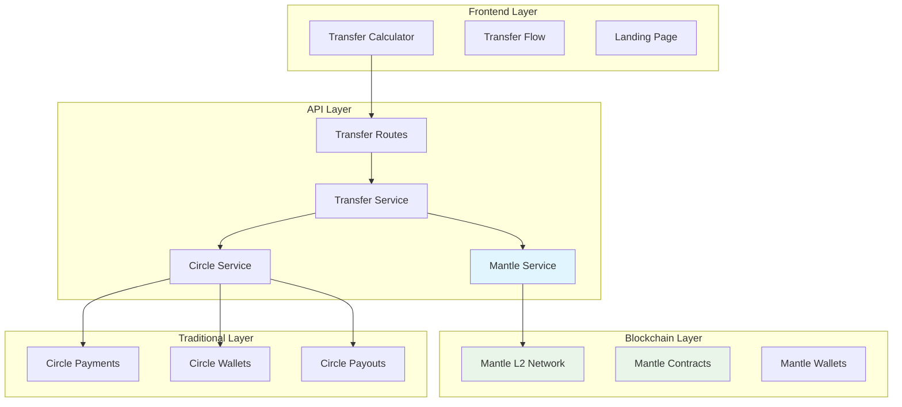
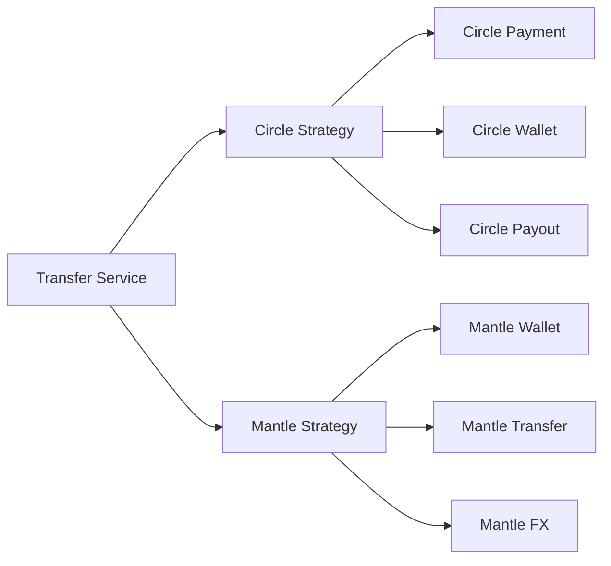

# Design Document

## Overview

This design integrates Mantle L2 blockchain as an alternative transfer method alongside the existing Circle infrastructure. The hybrid approach allows users to choose between traditional Circle transfers (reliable, regulated) and Mantle L2 transfers (fast, cheap) based on their needs. The integration leverages your existing transfer calculator, database schema, and service architecture while adding Mantle-specific capabilities.

## Architecture

### High-Level Architecture



### Service Integration Pattern

The design follows a **Strategy Pattern** where the Transfer Service acts as a context that delegates to either Circle or Mantle strategies based on user selection:



## Components and Interfaces

### 1. Enhanced Transfer Calculator

**Location**: `packages/web/src/components/features/TransferCalculator.tsx`

**Enhancements**:
- Add transfer method selection (Circle vs Mantle)
- Display comparative pricing and timing
- Show Mantle-specific benefits (gas savings, speed)
- Real-time network status indicators

**New Props**:
```typescript
interface TransferCalculatorProps {
  // ... existing props
  showTransferMethods?: boolean;
  defaultMethod?: 'circle' | 'mantle';
  mantleEnabled?: boolean;
}
```

### 2. Mantle Service

**Location**: `packages/api/src/services/mantle.service.ts`

**Core Interface**:
```typescript
interface MantleService {
  // Wallet Management
  createWallet(userId: string): Promise<MantleWallet>;
  getWalletBalance(walletId: string): Promise<WalletBalance>;
  
  // Transfer Operations
  initiateTransfer(request: MantleTransferRequest): Promise<MantleTransferResult>;
  getTransferStatus(transferId: string): Promise<TransferStatus>;
  
  // Network Operations
  estimateGasCost(amount: number, currency: string): Promise<GasEstimate>;
  getCurrentNetworkStatus(): Promise<NetworkStatus>;
  
  // Conversion Operations
  convertToStablecoin(amount: number, fromCurrency: string): Promise<ConversionResult>;
  convertFromStablecoin(amount: number, toCurrency: string): Promise<ConversionResult>;
}
```

### 3. Enhanced Transfer Service

**Location**: `packages/api/src/services/transfer.service.ts`

**New Methods**:
```typescript
class TransferService {
  // ... existing methods
  
  async createMantleTransfer(request: CreateMantleTransferRequest): Promise<TransferResult>;
  async calculateMantleTransfer(request: CalculateTransferRequest): Promise<TransferCalculation>;
  async getTransferMethodRecommendation(amount: number, currencies: CurrencyPair): Promise<MethodRecommendation>;
}
```

### 4. Mantle Network Configuration

**Location**: `packages/api/src/config/mantle.config.ts`

```typescript
interface MantleConfig {
  networkId: number;
  rpcUrl: string;
  explorerUrl: string;
  nativeToken: string;
  stablecoinAddress: string;
  bridgeContractAddress: string;
  gasLimit: {
    transfer: number;
    swap: number;
  };
  confirmationBlocks: number;
}
```

## Data Models

### Enhanced Transfer Schema

**Database Changes** (extends existing schema):
```sql
-- Add transfer method column
ALTER TABLE transfers ADD COLUMN transfer_method VARCHAR(20) DEFAULT 'circle';
ALTER TABLE transfers ADD COLUMN mantle_wallet_id VARCHAR(255);
ALTER TABLE transfers ADD COLUMN mantle_tx_hash VARCHAR(255);
ALTER TABLE transfers ADD COLUMN gas_cost_usd DECIMAL(10,2);
ALTER TABLE transfers ADD COLUMN network_fee_usd DECIMAL(10,2);

-- Add Mantle-specific tracking
CREATE TABLE mantle_transfers (
  id VARCHAR(255) PRIMARY KEY,
  transfer_id VARCHAR(255) REFERENCES transfers(id),
  sender_wallet_address VARCHAR(255) NOT NULL,
  recipient_wallet_address VARCHAR(255) NOT NULL,
  token_address VARCHAR(255) NOT NULL,
  amount_wei VARCHAR(255) NOT NULL,
  gas_price_gwei VARCHAR(255),
  gas_used VARCHAR(255),
  block_number BIGINT,
  transaction_hash VARCHAR(255) UNIQUE,
  status VARCHAR(50) DEFAULT 'PENDING',
  created_at TIMESTAMP DEFAULT CURRENT_TIMESTAMP,
  updated_at TIMESTAMP DEFAULT CURRENT_TIMESTAMP
);
```

### Transfer Method Selection

```typescript
interface TransferMethodOption {
  method: 'circle' | 'mantle';
  estimatedTime: string;
  totalCost: number;
  fees: {
    processing: number;
    network: number;
    exchange: number;
  };
  benefits: string[];
  limitations: string[];
  recommended: boolean;
  availableForAmount: boolean;
}
```

## Error Handling

### Mantle-Specific Error Types

```typescript
enum MantleErrorType {
  NETWORK_CONGESTION = 'NETWORK_CONGESTION',
  INSUFFICIENT_GAS = 'INSUFFICIENT_GAS',
  BRIDGE_UNAVAILABLE = 'BRIDGE_UNAVAILABLE',
  WALLET_CREATION_FAILED = 'WALLET_CREATION_FAILED',
  TRANSACTION_TIMEOUT = 'TRANSACTION_TIMEOUT',
  SLIPPAGE_EXCEEDED = 'SLIPPAGE_EXCEEDED'
}

class MantleError extends Error {
  constructor(
    public type: MantleErrorType,
    message: string,
    public retryable: boolean = false,
    public fallbackToCircle: boolean = true
  ) {
    super(message);
  }
}
```

### Graceful Fallback Strategy

1. **Network Issues**: Automatically fallback to Circle
2. **High Gas Costs**: Recommend Circle for cost efficiency
3. **Transaction Failures**: Retry with adjusted parameters or fallback
4. **Bridge Congestion**: Queue transaction or suggest Circle alternative

## Testing Strategy

### Unit Tests

**Mantle Service Tests**:
- Wallet creation and management
- Transfer initiation and monitoring
- Gas estimation accuracy
- Error handling and fallbacks

**Integration Tests**:
- End-to-end Mantle transfer flow
- Circle + Mantle hybrid scenarios
- Network switching and fallbacks
- Database consistency across methods

### Test Scenarios

1. **Happy Path**: Successful Mantle transfer from USD to EUR
2. **Network Congestion**: Fallback to Circle when Mantle is slow
3. **Cost Optimization**: System recommends cheaper option
4. **Partial Failure**: Mantle payment succeeds but payout fails
5. **User Preference**: User chooses Mantle despite higher cost

## Implementation Phases

### Phase 1: Core Mantle Integration (Week 1)
- Set up Mantle network configuration
- Implement basic MantleService
- Create wallet management functionality
- Add database schema changes

### Phase 2: Transfer Flow Integration (Week 1-2)
- Enhance TransferService with Mantle support
- Implement transfer method selection logic
- Add Mantle-specific error handling
- Create transfer monitoring and status updates

### Phase 3: Frontend Enhancement (Week 2)
- Update TransferCalculator with method selection
- Add Mantle branding and benefits display
- Implement real-time cost comparison
- Create network status indicators

### Phase 4: Landing Page Marketing (Week 2)
- Add "Powered by Mantle L2" sections
- Create comparison tables (traditional vs blockchain)
- Implement interactive demos
- Add cookathon-specific metrics and showcases

## Marketing Integration for Cookathon

### Landing Page Enhancements

**Hero Section Addition**:
```typescript
interface MantleHeroProps {
  title: "Lightning-Fast Transfers with Mantle L2";
  subtitle: "90% cheaper fees, 2-minute settlements";
  features: [
    "Powered by Mantle Layer 2 technology",
    "Traditional banking meets blockchain innovation", 
    "Choose your transfer method: reliable Circle or ultra-fast Mantle"
  ];
}
```

**Comparison Section**:
- Traditional transfers: 3-5 days, higher fees
- Mantle L2 transfers: 2 minutes, 90% lower fees
- Hybrid approach: Best of both worlds

**Technical Showcase**:
- Real-time transaction explorer integration
- Live network statistics
- Gas cost savings calculator
- Speed comparison metrics

### Value Propositions for Different Users

1. **Tech-Savvy Users**: Cutting-edge L2 technology, transparency, control
2. **Cost-Conscious Users**: Significant fee savings, especially for smaller amounts
3. **Speed-Focused Users**: Near-instant settlements vs traditional banking delays
4. **Risk-Averse Users**: Option to use traditional Circle when preferred

## Security Considerations

### Wallet Security
- Non-custodial wallet generation using secure entropy
- Private key encryption and secure storage
- Multi-signature support for high-value transfers

### Smart Contract Security
- Use audited Mantle bridge contracts
- Implement transfer limits and rate limiting
- Add emergency pause functionality

### User Protection
- Clear disclosure of blockchain vs traditional transfer risks
- Automatic fallback to Circle for failed Mantle transactions
- Transaction monitoring and anomaly detection

## Performance Optimization

### Caching Strategy
- Cache Mantle network status and gas prices
- Pre-calculate transfer routes and costs
- Cache exchange rates for both Circle and Mantle paths

### Batch Processing
- Batch multiple small transfers to reduce gas costs
- Implement transfer queuing during network congestion
- Optimize contract calls for gas efficiency

## Monitoring and Analytics

### Key Metrics
- Mantle vs Circle transfer volume and success rates
- Average gas costs and savings achieved
- User preference patterns and method selection
- Network performance and uptime statistics

### Dashboards
- Real-time transfer method performance comparison
- Cost savings achieved through Mantle integration
- User adoption rates and satisfaction metrics
- Technical performance indicators for cookathon presentation

This design provides a comprehensive integration of Mantle L2 that enhances your existing Circle infrastructure while positioning your platform as an innovative fintech solution that bridges traditional and blockchain-based financial services.