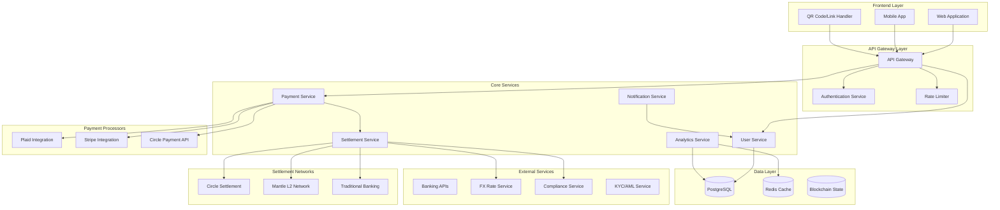

# Design Document

## Overview

The peer-to-peer payment system is designed as a comprehensive international money transfer platform that intelligently routes payments through optimal processors and settlement services. The system leverages existing Circle API and Mantle L2 blockchain integrations while adding intelligent decision-making capabilities for cost optimization and user experience enhancement.

The architecture follows a microservices pattern with clear separation of concerns: user management, payment processing, settlement routing, and notification services. The system supports both registered and unregistered users through dynamic onboarding flows and provides real-time status tracking throughout the transfer lifecycle.

## Architecture

### High-Level System Architecture



### Service Architecture

The system is built around five core services that handle different aspects of the payment flow:

1. **User Service**: Manages user accounts, bank account linking, and authentication
2. **Payment Service**: Handles payment processor selection and transaction initiation
3. **Settlement Service**: Routes funds through optimal settlement networks
4. **Notification Service**: Manages real-time updates and communications
5. **Analytics Service**: Tracks performance metrics and cost optimization data

## Components and Interfaces

### User Service

**Responsibilities:**
- User account creation and management
- Bank account linking and verification
- Multi-currency account designation
- User authentication and authorization

**Key Interfaces:**
```typescript
interface UserService {
  createUser(userData: UserRegistrationData): Promise<User>
  linkBankAccount(userId: string, bankAccount: BankAccountData): Promise<BankAccount>
  getUserBankAccounts(userId: string): Promise<BankAccount[]>
  verifyBankAccount(userId: string, accountId: string): Promise<VerificationResult>
  updatePrimaryCurrencyAccount(userId: string, currency: string, accountId: string): Promise<void>
}

interface BankAccountData {
  accountNumber: string
  routingNumber?: string
  iban?: string
  bic?: string
  currency: string
  country: string
  accountHolderName: string
  bankName: string
}
```

### Payment Request Service

**Responsibilities:**
- Generate payment requests for registered/unregistered users
- Create shareable QR codes and links
- Handle payment request lifecycle
- Manage request expiration and security

**Key Interfaces:**
```typescript
interface PaymentRequestService {
  createPaymentRequest(request: PaymentRequestData): Promise<PaymentRequest>
  generateQRCode(requestId: string): Promise<QRCodeData>
  generateShareableLink(requestId: string): Promise<string>
  processPaymentRequest(requestId: string, paymentData: PaymentData): Promise<PaymentResult>
  getRequestStatus(requestId: string): Promise<RequestStatus>
}

interface PaymentRequestData {
  requesterId: string
  amount: number
  currency: string
  description?: string
  expiresAt?: Date
  metadata?: Record<string, any>
}
```

### Payment Processor Selection Service

**Responsibilities:**
- Analyze user geographic location
- Evaluate available payment processors
- Select optimal processor based on efficiency and user experience
- Handle processor-specific integrations

**Key Interfaces:**
```typescript
interface PaymentProcessorService {
  analyzeUserLocation(userId: string): Promise<LocationData>
  getAvailableProcessors(location: LocationData): Promise<ProcessorOption[]>
  selectOptimalProcessor(options: ProcessorOption[], criteria: SelectionCriteria): Promise<ProcessorSelection>
  processPayment(processorId: string, paymentData: PaymentData): Promise<PaymentResult>
}

interface ProcessorOption {
  id: string
  name: string
  supportedCountries: string[]
  fees: FeeStructure
  processingTime: string
  userExperienceScore: number
  reliability: number
}
```

### Settlement Routing Service

**Responsibilities:**
- Analyze transaction costs across settlement networks
- Route funds through most cost-effective option
- Handle settlement network failures and fallbacks
- Monitor settlement completion

**Key Interfaces:**
```typescript
interface SettlementService {
  analyzeCosts(amount: number, fromCurrency: string, toCurrency: string): Promise<CostAnalysis>
  routeSettlement(settlementRequest: SettlementRequest): Promise<SettlementResult>
  monitorSettlement(settlementId: string): Promise<SettlementStatus>
  handleSettlementFailure(settlementId: string, error: SettlementError): Promise<FallbackResult>
}

interface CostAnalysis {
  circleOption: {
    totalCost: number
    fees: FeeBreakdown
    estimatedTime: string
  }
  mantleOption: {
    totalCost: number
    fees: FeeBreakdown
    estimatedTime: string
  }
  recommendedOption: 'circle' | 'mantle'
  costSavings: number
}
```

### Notification Service

**Responsibilities:**
- Send real-time payment status updates
- Handle multi-channel notifications (email, SMS, push)
- Manage notification preferences
- Track delivery status

**Key Interfaces:**
```typescript
interface NotificationService {
  sendPaymentStatusUpdate(userId: string, status: PaymentStatus): Promise<void>
  sendPaymentRequest(recipientData: RecipientData, request: PaymentRequest): Promise<void>
  sendPaymentConfirmation(senderId: string, recipientId: string, payment: PaymentResult): Promise<void>
  updateNotificationPreferences(userId: string, preferences: NotificationPreferences): Promise<void>
}
```

## Data Models

### User Model
```typescript
interface User {
  id: string
  email: string
  phone?: string
  firstName: string
  lastName: string
  country: string
  currency: string
  bankAccounts: BankAccount[]
  notificationPreferences: NotificationPreferences
  kycStatus: KYCStatus
  createdAt: Date
  updatedAt: Date
}
```

### Bank Account Model
```typescript
interface BankAccount {
  id: string
  userId: string
  currency: string
  country: string
  accountNumber: string
  routingNumber?: string
  iban?: string
  bic?: string
  accountHolderName: string
  bankName: string
  isPrimary: boolean
  verificationStatus: 'pending' | 'verified' | 'failed'
  verificationMethod: 'micro_deposit' | 'instant' | 'manual'
  createdAt: Date
  updatedAt: Date
}
```

### Payment Request Model
```typescript
interface PaymentRequest {
  id: string
  requesterId: string
  amount: number
  currency: string
  description?: string
  status: 'pending' | 'paid' | 'expired' | 'cancelled'
  qrCode?: string
  shareableLink?: string
  expiresAt: Date
  paidAt?: Date
  paymentId?: string
  metadata?: Record<string, any>
  createdAt: Date
  updatedAt: Date
}
```

### Payment Model
```typescript
interface Payment {
  id: string
  requestId?: string
  senderId: string
  recipientId: string
  amount: number
  currency: string
  exchangeRate?: number
  fees: number
  processorId: string
  settlementMethod: 'circle' | 'mantle'
  status: PaymentStatus
  timeline: PaymentEvent[]
  estimatedCompletion: Date
  completedAt?: Date
  metadata?: Record<string, any>
  createdAt: Date
  updatedAt: Date
}
```

### Settlement Transaction Model
```typescript
interface SettlementTransaction {
  id: string
  paymentId: string
  method: 'circle' | 'mantle'
  amount: number
  currency: string
  fees: number
  networkTransactionId?: string
  blockchainTxHash?: string
  status: SettlementStatus
  retryCount: number
  failureReason?: string
  completedAt?: Date
  createdAt: Date
  updatedAt: Date
}
```

## Error Handling

### Error Classification System

The system implements a comprehensive error classification system that categorizes errors by:
- **Severity**: Critical, High, Medium, Low
- **Recoverability**: Retryable, Non-retryable, Requires manual intervention
- **User Impact**: Service disruption, Degraded experience, No impact
- **Fallback Strategy**: Automatic retry, Alternative method, Manual resolution

### Error Types

```typescript
enum PaymentErrorType {
  // User-related errors
  INVALID_USER_DATA = 'INVALID_USER_DATA',
  INSUFFICIENT_FUNDS = 'INSUFFICIENT_FUNDS',
  ACCOUNT_VERIFICATION_FAILED = 'ACCOUNT_VERIFICATION_FAILED',
  
  // Payment processor errors
  PROCESSOR_UNAVAILABLE = 'PROCESSOR_UNAVAILABLE',
  PAYMENT_DECLINED = 'PAYMENT_DECLINED',
  PROCESSOR_TIMEOUT = 'PROCESSOR_TIMEOUT',
  
  // Settlement errors
  SETTLEMENT_NETWORK_ERROR = 'SETTLEMENT_NETWORK_ERROR',
  BLOCKCHAIN_CONGESTION = 'BLOCKCHAIN_CONGESTION',
  INSUFFICIENT_LIQUIDITY = 'INSUFFICIENT_LIQUIDITY',
  
  // System errors
  DATABASE_ERROR = 'DATABASE_ERROR',
  EXTERNAL_SERVICE_ERROR = 'EXTERNAL_SERVICE_ERROR',
  CONFIGURATION_ERROR = 'CONFIGURATION_ERROR'
}
```

### Fallback Strategies

1. **Payment Processor Fallback**: If primary processor fails, automatically try secondary processor
2. **Settlement Network Fallback**: If Mantle fails, fallback to Circle; if Circle fails, use traditional banking
3. **Geographic Fallback**: If location-specific processor unavailable, use global alternatives
4. **Retry Logic**: Exponential backoff for transient errors with maximum retry limits

## Testing Strategy

### Unit Testing
- **Coverage Target**: 90% code coverage for all core services
- **Test Categories**: 
  - Service method testing with mocked dependencies
  - Data model validation testing
  - Error handling and edge case testing
  - Configuration and environment testing

### Integration Testing
- **External Service Integration**: Mock external APIs (Circle, Mantle, payment processors)
- **Database Integration**: Test with real database connections using test containers
- **End-to-end Service Communication**: Test complete workflows between services

### End-to-End Testing
- **User Journey Testing**: Complete payment flows from request to settlement
- **Cross-border Testing**: Multi-currency and multi-country scenarios
- **Failure Scenario Testing**: Network failures, service outages, and recovery testing
- **Performance Testing**: Load testing for concurrent payment processing

### Test Data Management
```typescript
interface TestScenario {
  name: string
  userProfiles: TestUser[]
  paymentScenarios: PaymentTestCase[]
  expectedOutcomes: ExpectedResult[]
  failurePoints?: FailureInjection[]
}

interface PaymentTestCase {
  amount: number
  fromCurrency: string
  toCurrency: string
  senderCountry: string
  recipientCountry: string
  expectedProcessor: string
  expectedSettlementMethod: string
  expectedFees: number
  expectedDuration: string
}
```

### Monitoring and Observability

**Key Metrics to Track:**
- Payment success rates by processor and settlement method
- Average transaction completion times
- Cost savings achieved through intelligent routing
- User conversion rates (unregistered to registered)
- Geographic distribution of payment methods
- Error rates and failure patterns

**Alerting Strategy:**
- Real-time alerts for payment failures above threshold
- Settlement network health monitoring
- Processor availability and performance alerts
- Cost optimization opportunity alerts
- Security and fraud detection alerts

**Logging Strategy:**
- Structured logging with correlation IDs for request tracing
- Sensitive data masking for PCI compliance
- Audit trails for all financial transactions
- Performance metrics logging for optimization analysis

This design provides a robust, scalable foundation for the peer-to-peer payment system while leveraging existing infrastructure and maintaining flexibility for future enhancements.