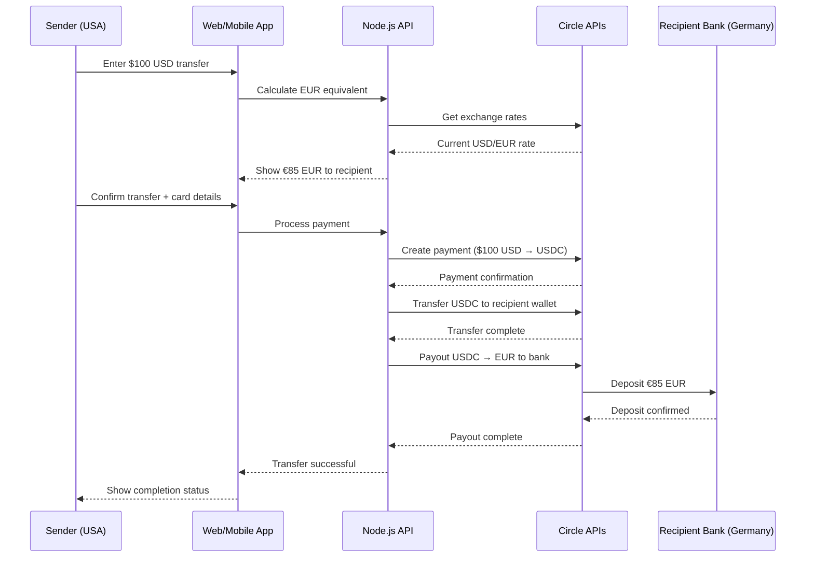

# Design Document

## Overview

The zero-friction international transfer system is built on Circle's regulated financial infrastructure to provide seamless cross-border money transfers. The architecture leverages Circle's Payments API for card processing, Programmable Wallets for secure custody, and Payouts API for bank deposits, eliminating the complexity of managing cryptocurrency infrastructure while providing a complete end-to-end solution.

## Architecture

### High-Level Flow


### System Components

1. **Frontend Application** (React/Next.js)
   - Responsive web interface optimized for mobile
   - Real-time exchange rate display
   - Payment form with card input
   - Transfer status tracking

2. **Backend API** (Node.js/Express)
   - Circle API integration layer
   - Transfer orchestration logic
   - User session management
   - Webhook handling for status updates

3. **Circle Integration**
   - Payments API for card → USDC conversion
   - Programmable Wallets for secure custody
   - Payouts API for USDC → EUR bank deposits

## Components and Interfaces

### Frontend Components

#### TransferCalculator
```typescript
interface TransferCalculatorProps {
  sendAmount: number;
  sendCurrency: 'USD';
  receiveCurrency: 'EUR';
  onAmountChange: (amount: number) => void;
}
```
- Real-time exchange rate calculation
- Input validation and formatting
- Visual feedback for rate changes

#### PaymentForm
```typescript
interface PaymentFormProps {
  transferAmount: number;
  recipientAmount: number;
  onSubmit: (paymentData: PaymentData) => void;
}

interface PaymentData {
  cardDetails: CardDetails;
  recipientInfo: RecipientInfo;
}
```
- Secure card input using Circle's payment elements
- Recipient bank account collection
- Form validation and error handling

#### TransferStatus
```typescript
interface TransferStatusProps {
  transferId: string;
  status: TransferStatus;
  timeline: TransferEvent[];
}

enum TransferStatus {
  INITIATED = 'initiated',
  PAYMENT_PROCESSING = 'payment_processing',
  TRANSFERRING = 'transferring',
  PAYING_OUT = 'paying_out',
  COMPLETED = 'completed',
  FAILED = 'failed'
}
```

### Backend API Endpoints

#### POST /api/transfers/calculate
```typescript
interface CalculateRequest {
  sendAmount: number;
  sendCurrency: 'USD';
  receiveCurrency: 'EUR';
}

interface CalculateResponse {
  sendAmount: number;
  receiveAmount: number;
  exchangeRate: number;
  fees: number;
  rateValidUntil: string;
}
```

#### POST /api/transfers/create
```typescript
interface CreateTransferRequest {
  sendAmount: number;
  cardDetails: CardDetails;
  recipientInfo: RecipientInfo;
  rateId: string; // Lock in exchange rate
}

interface CreateTransferResponse {
  transferId: string;
  status: TransferStatus;
  estimatedCompletion: string;
}
```

#### GET /api/transfers/:id/status
```typescript
interface TransferStatusResponse {
  transferId: string;
  status: TransferStatus;
  timeline: TransferEvent[];
  sendAmount: number;
  receiveAmount: number;
  fees: number;
}
```

### Circle API Integration

#### Payment Processing
```typescript
class CirclePaymentService {
  async createPayment(amount: number, cardDetails: CardDetails): Promise<Payment> {
    return await this.circleClient.payments.create({
      amount: { amount: amount.toString(), currency: 'USD' },
      source: { type: 'card', ...cardDetails },
      description: 'International transfer'
    });
  }
}
```

#### Wallet Management
```typescript
class CircleWalletService {
  async createWallet(userId: string): Promise<Wallet> {
    return await this.circleClient.wallets.create({
      idempotencyKey: `wallet-${userId}-${Date.now()}`,
      entitySecretCiphertext: await this.encryptEntitySecret()
    });
  }

  async transferFunds(fromWallet: string, toWallet: string, amount: string): Promise<Transfer> {
    return await this.circleClient.transfers.create({
      source: { type: 'wallet', id: fromWallet },
      destination: { type: 'wallet', id: toWallet },
      amount: { amount, currency: 'USD' }
    });
  }
}
```

#### Payout Processing
```typescript
class CirclePayoutService {
  async createPayout(amount: number, bankAccount: BankAccount): Promise<Payout> {
    return await this.circleClient.payouts.create({
      amount: { amount: amount.toString(), currency: 'EUR' },
      destination: {
        type: 'wire',
        beneficiary: bankAccount
      }
    });
  }
}
```

## Data Models

### Transfer
```typescript
interface Transfer {
  id: string;
  sendAmount: number;
  sendCurrency: 'USD';
  receiveAmount: number;
  receiveCurrency: 'EUR';
  exchangeRate: number;
  fees: number;
  status: TransferStatus;
  senderWalletId: string;
  recipientWalletId: string;
  paymentId?: string;
  payoutId?: string;
  createdAt: Date;
  completedAt?: Date;
  timeline: TransferEvent[];
}
```

### RecipientInfo
```typescript
interface RecipientInfo {
  name: string;
  email: string;
  bankAccount: {
    iban: string;
    bic: string;
    bankName: string;
    accountHolderName: string;
    country: 'DE';
  };
}
```

### TransferEvent
```typescript
interface TransferEvent {
  id: string;
  transferId: string;
  type: 'payment_created' | 'payment_confirmed' | 'transfer_initiated' | 'payout_created' | 'payout_completed';
  status: 'success' | 'pending' | 'failed';
  message: string;
  timestamp: Date;
  metadata?: Record<string, any>;
}
```

## Error Handling

### Payment Failures
- Card declined: Provide clear messaging and retry options
- Insufficient funds: Suggest alternative payment methods
- 3D Secure failures: Guide user through authentication

### Transfer Failures
- Network issues: Implement exponential backoff retry logic
- Rate limit exceeded: Queue requests and process sequentially
- Wallet creation failures: Fallback to alternative wallet generation

### Payout Failures
- Invalid bank details: Validate IBAN/BIC before processing
- Bank rejection: Provide specific error codes and resolution steps
- Compliance holds: Clear communication about review process

### Error Response Format
```typescript
interface ErrorResponse {
  error: {
    code: string;
    message: string;
    details?: Record<string, any>;
    retryable: boolean;
  };
  requestId: string;
}
```

## Testing Strategy

### Unit Testing
- Circle API service layer mocking
- Exchange rate calculation logic
- Input validation and sanitization
- Error handling scenarios

### Integration Testing
- Circle sandbox environment testing
- End-to-end payment flows
- Webhook processing
- Database operations

### User Acceptance Testing
- Complete transfer flow from USD to EUR
- Mobile responsiveness testing
- Error scenario handling
- Performance under load

### Test Data Management
```typescript
const testScenarios = {
  successfulTransfer: {
    sendAmount: 100,
    expectedReceiveAmount: 85,
    testCard: '4007400000000007' // Circle test card
  },
  failedPayment: {
    sendAmount: 100,
    testCard: '4000000000000002' // Declined card
  },
  invalidRecipient: {
    iban: 'INVALID_IBAN',
    expectedError: 'INVALID_BANK_DETAILS'
  }
};
```

### Performance Requirements
- Payment processing: < 30 seconds
- Transfer completion: < 5 minutes
- Status updates: Real-time via WebSocket
- Mobile load time: < 3 seconds

### Security Considerations
- All sensitive data encrypted at rest
- PCI DSS compliance through Circle
- Rate limiting on API endpoints
- Input sanitization and validation
- Secure webhook signature verification